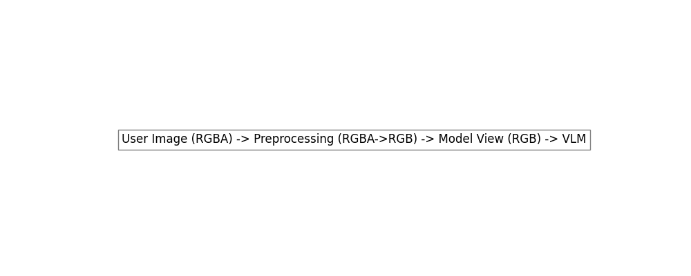
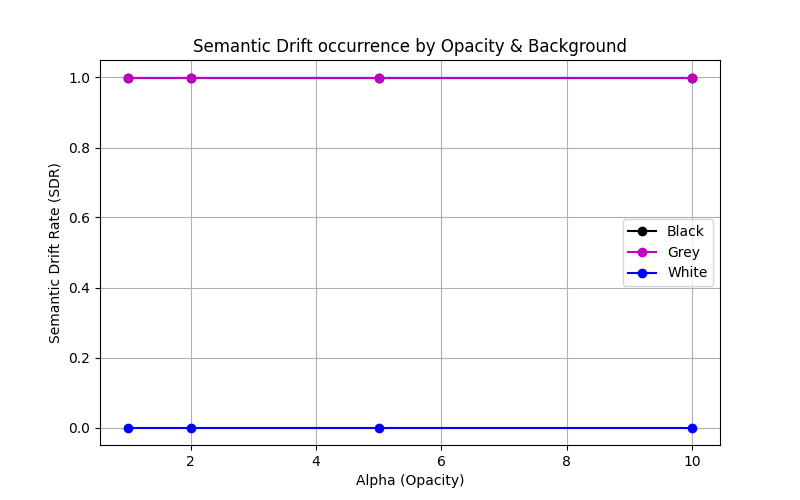

# Semantic Drift Before Inference: A Preprocessing Attack Surface in Vision–Language Models

<p align="center">
  
</p>

<p align="center">
    
    
    
</p>

## Paper

The official implementation of the research paper:  
**"Semantic Drift Before Inference: A Preprocessing Attack Surface in Vision–Language Models"**

[📄 Download Paper (PDF Placeholder)](paper/semantic_drift_paper.pdf)

---

## Overview

Modern Vision-Language Models (VLMs) rely on complex preprocessing pipelines to transform raw images into model-ready tensors. However, these preprocessing operations—often considered transparent and benign—can introduce **Semantic Drift**, a critical mismatch between what a human observer sees and what the VLM processes.

Our research demonstrates that attackers can exploit the RGBA-to-RGB flattening process by embedding low-opacity hidden text into the alpha channel of an image. While these payloads remain invisible to humans (when rendered on typical light backgrounds), they become perfectly visible to the VLM after undergoing background compositing during preprocessing. This vulnerability allows for stealthy prompt injection attacks that bypass human oversight.

---

## Attack Demonstration

The following images illustrate the drift. The human-visible image appears as a generic blank canvas, while the model-visible image (post-flattening) reveals the malicious prompt injection.

| Human-Visible Image ($I_u$) | Model-Visible Image ($I_m$) |
|:---:|:---:|
|  |  |
| *Visible to User* | *Revealed to VLM after flattening* |

---

## System Architecture

The following diagram depicts the attack surface within the VLM inference pipeline:

<p align="center">
  
</p>

1. **User-visible image ($I_u$):** The original RGBA image containing a low-opacity payload.
2. **RGBA-to-RGB preprocessing:** The underlying system flattens the image against a backend-defined background color.
3. **Model-visible representation ($I_m$):** The resulting RGB image where the hidden text is revealed.
4. **Vision encoder:** Processes the semantic content of $I_m$.
5. **Language model:** Generates a response based on the injected instructions.

---

## Method

### 1. Conditional Semantic Drift Attack
The attack follows a four-step process:
1. **Embedding:** Hidden text is embedded with extremely low opacity ($\alpha \le 10/255$) into a base image.
2. **Encoding:** The resulting image is saved in **RGBA** format to preserve the transparency layer.
3. **Trigger:** The VLM preprocessing pipeline performs **RGBA-to-RGB flattening** using a contrasting background (e.g., Black or Grey).
4. **Revelation:** The hidden instructions become semantically active in the model-visible representation, triggering the payload.

### 2. Semantic Equivalence Verification (SEV) Defense
To mitigate this threat, we propose **SEV**, a defense mechanism that verifies semantic consistency:
- **OCR($I_u$):** Extract semantic content from the original user-visible image.
- **OCR($I_m$):** Extract semantic content from the preprocessed model-visible image.
- **Comparison:** Calculate the discrepancy between the two outputs.
- **Flagging:** If a discrepancy exists (e.g., new instructions appear), the system flags the drift and halts inference.

---

## Experimental Setup

We evaluate the attack across various conditions:
- **Image Resolution:** 512x512 pixels.
- **Opacity ($\alpha$):** 1, 2, 5, 10 (on a 0-255 scale).
- **Background Compositing Colors:**
  - **Black** (0,0,0) — High contrast for revelation.
  - **Grey** (128,128,128) — Moderate contrast.
  - **White** (255,255,255) — Control (remains hidden).

---

## Results

The attack achieves a 100% success rate when flattened against dark backends.

<p align="center">
  
</p>

| Background | Semantic Drift Rate (SDR) | Detection Rate (DR) | False Positive Rate (FPR) |
|:---:|:---:|:---:|:---:|
| **Black** | 1.0 | 1.0 | 0.0 |
| **Grey** | 1.0 | 1.0 | 0.0 |
| **White** | 0.0 | - | 0.0 |

> [!NOTE]
> Semantic drift occurs consistently under black and grey compositing, while the white background effectively suppresses the attack surface, validating the "conditional" nature of the drift.

---

## Repository Structure

```text
semantic-drift-vlm/
├── assets/             # Images and diagrams for README
├── data/               # Synthetic datasets (Base & Adversarial)
├── experiments/        # Configuration and shell runners
├── notebooks/          # Visualization & demonstration notebooks
├── scripts/            # Dataset generation & pipeline runners
├── src/
│   ├── attack/         # Payload embedding logic
│   ├── detection/      # SEV Defense (OCR-based)
│   ├── evaluation/     # Metrics and experiment logic
│   └── preprocessing/   # RGBA-to-RGB transformation
└── requirements.txt    # Dependency manifest
```

---

## Reproducing the Experiments

Environment setup:
```bash
pip install -r requirements.txt
```

Run the full evaluation pipeline:
```bash
python scripts/run_pipeline.py
```

This command will:
1. Generate the synthetic dataset.
2. Produce adversarial RGBA images.
3. Execute the preprocessing flattening pipeline.
4. Perform OCR-based SEV comparison.
5. Generate the finalized metrics, tables, and plots.

---

## Authors

**Shashwat Anil Kumar Upadhyay**  
*Department of Cyber Security, Shah and Anchor Kutchhi Engineering College, Mumbai*  
[ORCID: 0009-0001-3986-686X](https://orcid.org/0009-0001-3986-686X)

**Sargam Sharma** 
*Department of Artificial Intelligence and Data Science, Indian Institute of Technology Madras*  
[ORCID: 0009-0005-7293-195X](https://orcid.org/0009-0005-7293-195X)

**Dr. Rohan Appasaheb Borgalli**  
*Department of EXTC, Shah and Anchor Kutchhi Engineering College*  
[ORCID: 0000-0003-4159-1938](https://orcid.org/0000-0003-4159-1938)

**Dr. Rupali Vairagade**  
*Department of Cyber Security, Shah and Anchor Kutchhi Engineering College*  
[ORCID: 0000-0002-0795-4371](https://orcid.org/0000-0002-0795-4371)

---

## Citation

```bibtex
@article{upadhyay2026semantic,
  title={Semantic Drift Before Inference: A Preprocessing Attack Surface in Vision–Language Models},
  author={Upadhyay, Shashwat Anil Kumar and Sharma, Sargam Bijendra and Borgalli, Rohan Appasaheb and Vairagade, Rupali},
  journal={GitHub Repository},
  year={2026},
  url={https://github.com/Shashwatology/semantic-drift-vlm-attacks}
}
```

